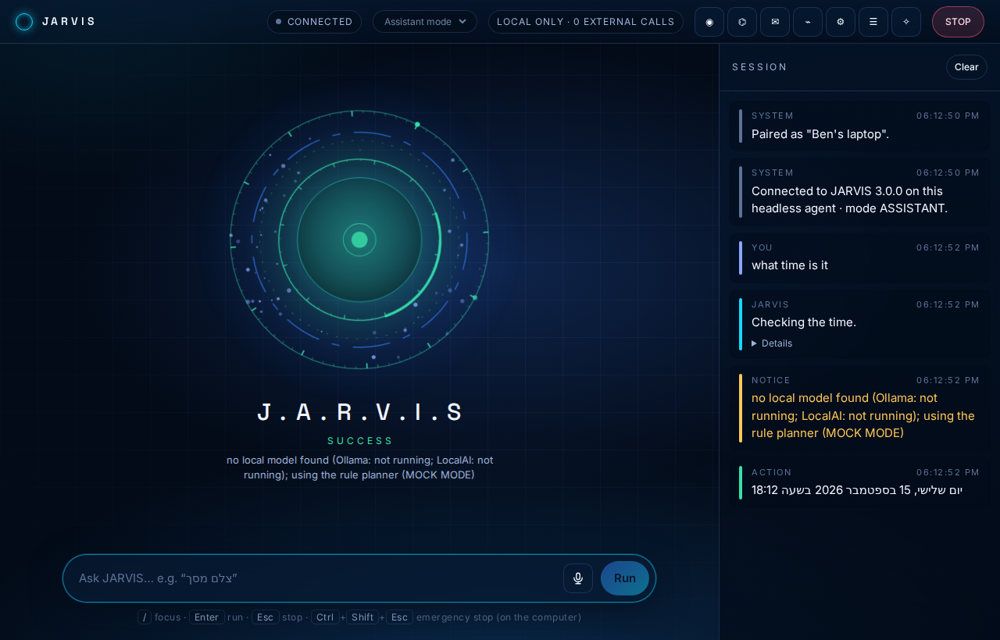

# JARVIS

<p align="center"></p>

A **self-contained** local AI assistant that really controls your Windows computer.
No cloud, no account, no API key, no subscription, no payment — anywhere, ever.

Public page: <https://benmor042012-maker.github.io/jarvis/> (explains and links the download; a web page can never control a computer — the installed agent does).

<div dir="rtl">

## התחלה מהירה

```
git clone https://github.com/benmor042012-maker/jarvis.git
cd jarvis
npm run setup     # מתקין, בונה ומריץ את כל הבדיקות
npm start         # פותח את ג'רביס
```

ב-Windows אפשר פשוט ללחוץ פעמיים על **`INSTALL-JARVIS.bat`**.

דרוש Node.js 18+. בינה מלאכותית מקומית היא אופציונלית: אם יש Ollama או LocalAI — ג'רביס משתמש בהם;
אם אין — הוא אומר **MOCK MODE** במפורש ועובר למתכנן כללים דטרמיניסטי, בלי להעמיד פנים.

| מצב | מה מותר |
|---|---|
| **Safe** | קריאה בלבד, פעולות הפיכות |
| **Assistant** | ברירת מחדל; בינוני וגבוה מבקשים אישור |
| **Advanced** | מדיניות משלך לכל כלי; סיכון גבוה עדיין שואל תמיד |
| **Emergency stopped** | שום דבר לא רץ |

עצירת חירום: <kbd>Ctrl+Shift+Esc</kbd> מכל מקום, או כפתור **STOP**.

</div>

---

## What it is

Three pieces, all on your machine:

| Piece | What it does |
| --- | --- |
| **Agent core** (`desktop/src/core`) | Tool registry, permission policy, signed command protocol, device pairing, executor, audit log, local HTTP server. Pure Node, no dependencies. |
| **Desktop shell** (`desktop/main.js`) | Electron: tray, hide-to-tray, Windows auto-start, global emergency-stop hotkey, the native second confirmation for high-risk actions, and the built-in browser used for form automation. |
| **Interface** (`client/`) | The React UI with the J.A.R.V.I.S orb. Served by the agent at `http://127.0.0.1:8765` — the same page your phone opens over Wi-Fi after pairing. |

The GitHub Pages site is documentation only. Browsers block page access to files, mouse and
keyboard; that is a browser security guarantee and nothing can work around it.

## What it can do

**Computer control** (typed tools, each with a schema, risk level, timeout, cancellation,
permission rule and audit redaction policy):

| Category | Tools | Risk |
| --- | --- | --- |
| Apps | `open_app`, `open_url`, `open_file` / `close_app` | low / medium |
| Files | `list_files`, `read_file`, `create_folder`, `search_files`, `list_trash` / `write_file`, `move_file` / `overwrite_file`, `delete_file` | low / medium / high |
| Screen | `screen_info`, `list_windows`, `focus_window`, `minimize_window`, `maximize_window` / `screenshot`, `close_window` | low / medium |
| Input | `mouse_move`, `mouse_scroll` / `mouse_click`, `mouse_drag`, `key_combo`, `keyboard_type` | low / medium |
| Clipboard | `clipboard_write` / `clipboard_read` | low / medium |
| Shell | `run_command`, `run_powershell` | high |
| Browser | `browser_fill_form` (preview, never submits) / `browser_submit_form` | medium / high |
| Drafts | `create_email_draft` (.eml), `create_calendar_draft` (.ics) — never sent | low |
| Info & memory | `current_time`, `calculate`, `remember`, `recall`, `forget`, `set_reminder`, `list_reminders`, `cancel_reminder` | low / medium |

**Project builder** — websites, APIs, desktop apps, PWAs and installer configs from deterministic
templates plus the local model, in isolated folders under `~/.jarvis/projects`, with git
checkpoints, real test/build runs, secret scanning and dependency/license checks. It never
publishes or uploads: that stays yours to do.

**Customer drafts** — Hebrew and English templates, tone changes, optional local-model rewriting
and translation, opt-out list, duplicate prevention and rate-limit simulation.
Labelled **DRAFT ONLY — NOTHING IS SENT**, because there is no sending code in the product at all.

## Security model

Every command from any device carries a signed envelope:

```json
{ "v": 1, "id": "<uuid>", "device_id": "…", "ts": 0, "expires": 0, "nonce": "…",
  "params": {}, "params_hash": "<sha256>", "signature": "<hmac-sha256>", "session": "…" }
```

The agent rejects anything **malformed, expired, replayed, duplicated, unauthorized or modified**.
Then every command follows the same path: receive → build a readable plan → show every action,
target, parameter, risk and reversibility → ask for approval when required → bind that approval to
the exact plan hash → execute with a timeout and a cancel signal → write a redacted audit event →
return `completed`, `partial`, `failed`, `cancelled`, `denied`, `expired` or `offline`.

- High-risk actions approved from a phone also need a **second confirmation on the computer**.
- The server binds to `127.0.0.1` unless you enable LAN access; there is no relay and no tunnel.
- Public `Host` headers are refused (DNS-rebinding defence), and only the UI's own origin gets CORS.
- Shell tools take an argv array, never a shell string; PowerShell receives user values through
  environment variables, so nothing is ever concatenated into a script.
- Cancellation and the emergency stop kill the **whole child-process tree**.
- Passwords, cookies, private keys and secret-looking files are blocked by path policy.
- The audit log never stores clipboard contents, typed text, file contents or screenshots — only
  sizes, paths and outcomes.

## Phone access

Enable LAN access in Settings, then **Devices → Pair a new device**: the computer shows an 8-digit
single-use code (and a QR) that expires in 5 minutes. From the phone you can see status, send
commands, approve plans, read the redacted log and revoke the device. When the computer is off,
asleep, disconnected or the agent is stopped, the phone says exactly that — it never shows a fake
connected state.

## Commands

```bash
npm run setup           # install + build + test
npm start               # desktop agent (or headless if Electron is missing)
npm run headless        # agent without a window (Linux/servers/CI)
npm test                # agent test suite
npm run verify          # tests + lint + typecheck + build + self-contained scan
npm run build:installer # Windows installer into desktop/dist
```

## Where your data lives

```
~/.jarvis/
  config.json     settings
  devices.json    paired devices (secrets encrypted by the OS when available)
  workspace/      the folder file tools may touch by default
  projects/       project builder workspaces
  drafts/         customer drafts, .eml and .ics files
  logs/           redacted audit log, one file per day
  trash/          what "delete" actually does
  temp/           screenshots
```

Export or delete all of it from **Activity log → Export my data / Delete local data**.

## Limits, stated honestly

- Mouse, keyboard, window and screen-info tools use Windows APIs. On macOS and Linux they report
  themselves unavailable with the reason; the rest of JARVIS keeps working.
- Browser automation needs the Electron window (it uses the built-in Chromium). Headless mode says so.
- Headless mode cannot show the native second confirmation, so high-risk plans approved remotely
  are refused there rather than run unconfirmed.
- Local models are smaller than hosted assistants: they can misunderstand and are slower. Every plan
  is validated against the tool schemas and shown to you before anything runs, and you can always
  fall back to the deterministic rule planner.
- A computer that is off, asleep without wake support, or disconnected cannot be controlled.

## License

MIT.
